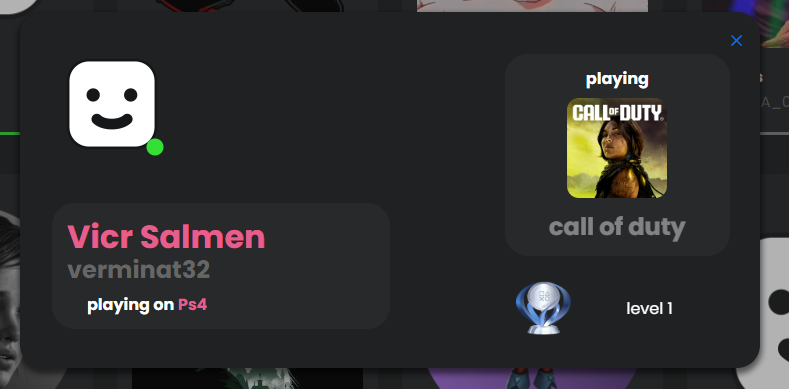
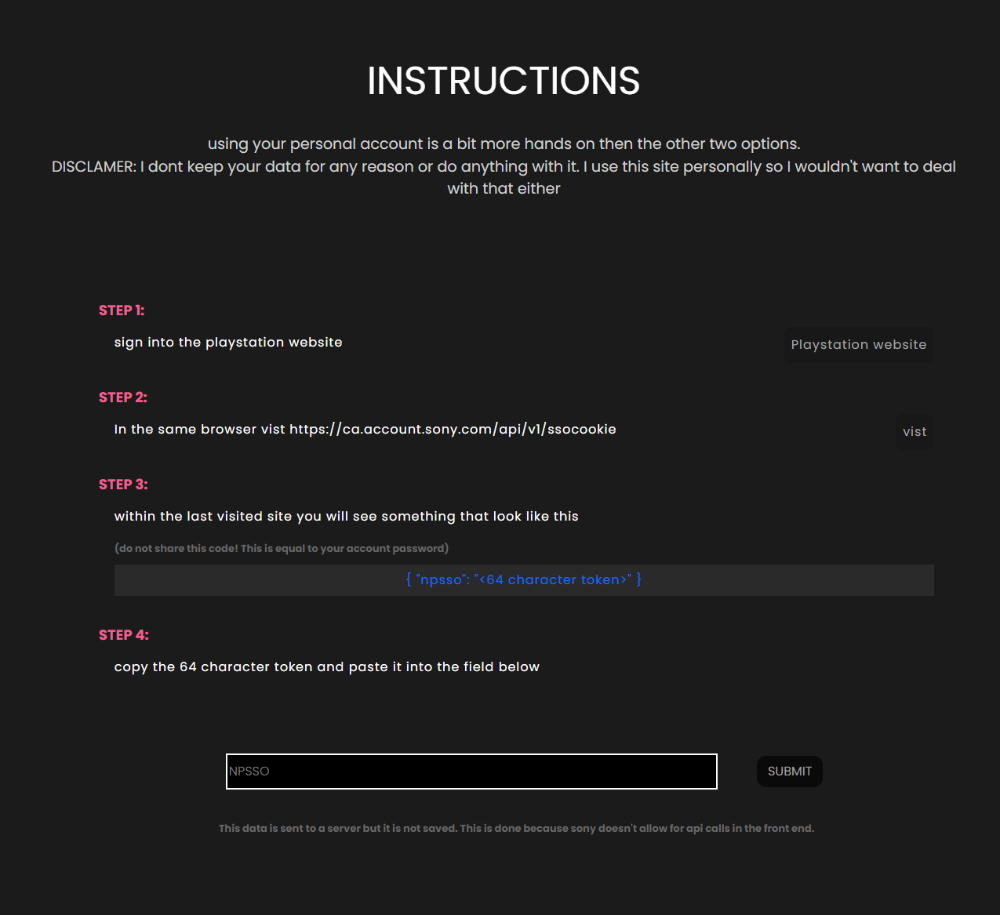

 
<h1 style="color:white">Better-PSN</h1>

 <!-- view live site link -->
 <a href="https://ls2355.github.io/Better-PSN/">
  <!-- styleing is in the src url= https://custom-icon-badges.demolab.com/badge/ <text>-<color> ?style=<style> &logo=<logo>   -->
   
 </a> 
<!-- for more info got to https://github.com/DenverCoder1/custom-icon-badges -->


<h2 style="color:#e3de40"> Purpose: </h2>
<h4> This project was created because Sony does not offer the ability to see your PlayStation network, friends status without using your consul, or their specific application.</h4>

<h2 style="color:#04857a"> Features </h2>
  <h4>List of Features in order</h4>
  <ul>
    <li>view PSN friends online status</li>
    <li>view friend personal info</li>
        if they share it with you
    <li>view friend current activity (games)</li>
    <li>view friend account trophie level</li>
    <li>view last online status</li>
  </ul>

#### 🗒️ NOTE <br />

<p> - if you add to your personal machine you can just add your NPSSO code directly in the API/playstions.js file, so you don't have to constantly retype it</p>

#### ⚠️Important Information⚠️
  <p style="background:#780a0A; padding: 5px 3px; width:80%; border-radius:5px;">server for fetching personal data is not Live. Page is only static for demonstrative purposes </p>

---
<h3>PSN Friends</h3>
  
  <p>View - online status</p>
  <p>View - personal Info (if they share it)</p>
  <p>View - current activity (what they are playing)</p>
  <p>View - last time they've been active</p>

---
<h3>How it works</h3>
  
  <p>All information is gathered from sony's public API</p>
  <p>your acount info is reached using a code you get from sony called NPSSO. (do not share this code it is the equivalent to your account password)</p>
  <p>all the information used is not stored. (I don't care about your info)</p>

---

<h2>Installation and Running on private machine 🌐</h2>
  <p>if you just want to see a demo click on the better-PSN site like at the top of the doc</p>
  <ol>
  <li>download Zip or clone</li>
  <li> travel to Client folder and install dependancies

    ``` 
    cd ./Client
    npm i
    ```

  </li>
  <li> travel to server folder and install dependancies

    ``` 
    cd ../API
    npm i
    ```

  </li>
  <li> 
  make sure to get your NPSSO code before hand. (walk through has been provided, it's on the Better-PSN site, just click PersonalAccount to see steps)
  </li>
  <li> Run Backend and front end 

    ``` 
    npm start
    cd ../Client
    npm run dev
    ```
  </li>

  </ol>


## Tech Stack:
<!-- to cange color to hex value put %23<value> after color -->


 
 
 
 
 
 

 
 


<details><summary>Notes to self (just ignore this)</summary>
look at the rollup documentation so that i can properly configure the webpack. 
the main issue is that images are not appearing
also see if i can get the server to run using github actions as well

then run build again


</details>
